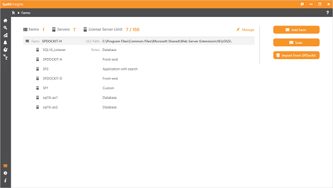

# Farms Screen

On the main application window click **Farms.** You will see a number of added farms, servers and a License Server Limit, as well as an overview of all the servers in farms. You can also see which SQL servers are in a cluster and instances that are monitored.

## There are three ways to add a new farm:

### Add Farm

To add a farm you simply need to enter a name of the SharePoint server which is a part of that farm. We will autodiscover all other servers in the farm.  
1. **Enter \(SharePoint\) server name** or FQDN and press Test Connection. If the everything is in order green check mark will appear. Click Next to continue. 1. In the next step you will see the detected farm. You can configure server roles, edit ULS Path, modify detected farms' name or remove servers from a farm.

* If you wish to add an extra server to the farm click **Add Server.**
  * Enter the server name, select a role and click **Add server.** When done click **Save** and the server will be added to the farm.  
    1. Finally you will see an overview on how many servers you are adding. **Click Finish** to save your work.

### Scan

1. You can search for Organisational Units by name, or you can use a dropdown menu to select the ones you want. 
2. After the scan is complete you will see the detected farm/s. You can configure server roles, edit ULS Path, modify detected farms' name or remove servers from a farm. 
   * If you wish to add an extra server to the farm click **Add Server.**
     * Enter the server name, select a role and click **Add server.** When done click **Save** and the server will be added to the farm.  
3. Finally you will see an overview on how many servers you are adding. **Click Finish** to save your work.

### Import from SPDocKit

You can import farm and servers from SPDocKit database. SPDocKit is SharePoint Admin tool for farm documentation and permission management. [See here](https://www.spdockit.com/) for more information. We support SPDocKit database from version 7 and onward. And, the **service account** you are using needs to have read permissions on the SPDocKit database.  
**Please note** that the service account we are talking about now, is Syskit Insights service account, and not the account you are using with SPDocKit. 1. Enter the Database Server and Name. Choose Authentication type and click Test Connection. Click Next to continue. 1. On **Detected Farms** screen you will see the detected farm. You can configure server roles, edit ULS Path, modify detected farms' name or remove servers from a farm.

* If you wish to add an extra server to the farm click **Add Server.**
  * Enter the server name, select a role and click **Add server.** When done click **Save** and the server will be added to the farm.  
    1. Finally you will see an overview on how many farms and servers you are adding. **Click Finish** to save your work.

## Manage farms:

Also, you can manage already added farms by clicking the **Manage button.**

* You can configure server roles, edit ULS Path, modify detected farms' name or remove servers from a farm. 
* To add a new server click **Add Server.**
  * Enter the server name, select a role and click **Add server.** When done click **Save** and the server will be added to the farm.  
* Note that you can also add 3rd party servers, such as: Office Web Apps Server...         
* When done, click **Save** to confirm your changes. 

## Refresh farm configuration:

When adding a new server to a farm, you don’t need to add it manually. Simply click the **Refresh Farm Configuration** button and all new servers will be added. Also, your ULS location, if changed in the meantime, will also be updated.  
A system job will also automatically perform this refresh every night at 4:00 a.m.

