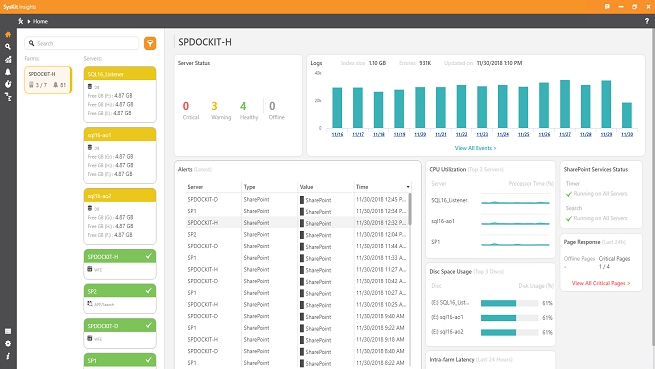

# Home Dashboard

 If you are monitoring multiple SharePoint farms, they will all appear here. The metrics shown will change depending on which farm or server is selected.

## Farm dashboard

* **Server Status** – Information about how many servers are in the critical, warning, healthy or offline state.
* **Logs** – Total number of events collected per day. If you click on the date or on the column representing the events, the graph will change into a Logs by Server view and you will see the total number of events per server collected for the selected day.

  The Total Index Size and Number of Events in the index are shown at the top of the graph. Also, you can see the Last Update Time of the index.

  The index size can fluctuate because of how index reorganization works. Also, since the data retention job deletes data day by day, sudden drops in this metric are possible.

* **Alerts** – An overview of alerts received for the entire farm. For a detailed view, click the View All Alerts button at the bottom of the tile.
* **CPU Utilization** – The top three servers with the highest processor usage based on the last 15 minutes of data collected.
* **Disk Space Usage** – The top three disks by disk space used across all servers, based on the last collected value.
* **SharePoint Services Status** – Whether SharePoint Timer, Search, or User Profile Services are running on the selected farm.
* **Intra-farm Latency** – Shows the servers \(if any\) with high latency. At the bottom, the + X Critical Servers button will take you to the latency tab, which has detailed information about latency.
* **Page Response** – Shows whether the pages you are monitoring are offline or critical.

## Server dashboard

To see the server dashboard, click on any server in the navigation.

* **Logs** – The graph will show the number of events by type per selected server on a given day. You can see the total number of event log, SQL and ULS events.
* **Alerts** – The latest alerts for the selected server.
* **Server Performance** – A list of performance counters currently in a critical or warning state.
* **Services Status** – Whether there is a stopped service on the selected server.
* **Intra-farm Latency** – Latency status for the selected server.

