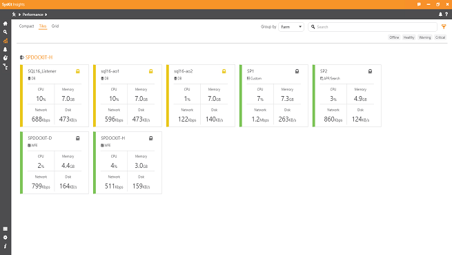
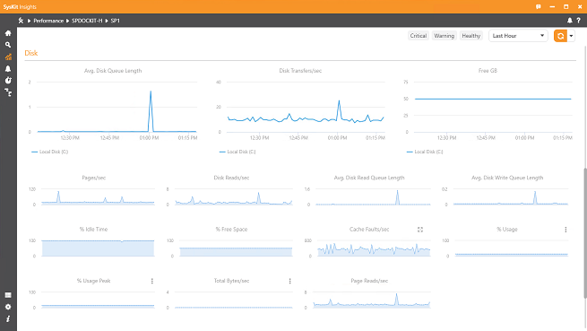

# Performance Screen

SysKit Insights collects performance data by default. This behaviour can be modified in the settings. Additionally user can change the performance data collection interval. The default value is 60 seconds.

The SysKit Insights Agent relies on performance counters to monitor the server performance. The SysKit Insights calculates the following server status:

* Healthy – colored green
* Warning – colored yellow
* Critical – colored red
* Offline or not accessible – colored grey

The server is in critical state if at least one metric collected is in critical state, in warning state if at least one metric is in warning state and none of the other metrics are in critical state, and the server is in healthy state if there are no metrics in warning or critical state.

The individual metrics are calculated based on their average value during the last 15 minutes. By using this approach the SysKit Insights can ignore short spikes in activity.

You can filter servers using these statuses. While on Performance tab click on the **Filter icon**, located right of the search bar. Clicking on the desired status will filter servers. You can even combine more then one status. Such as Warning and Critical.

When the user is located on Performance tab of SysKit Insights a help link will be show. Following that link user can see all the details about the metrics SysKit Insights Agent collects. The description of each metric, warning and error thresholds are listed \(where applicable\).

## Farms Performance Overview Dashboard

The farms performance overview dashboard shows all farms currently monitored by SysKit Insights Agent. It shows status for each server in those farms. Additionally it displays main performance metrics \(CPU usage, RAM usage, network usage and disk usage\) for each server in a concise manner. Users can choose between three different views: Compact, Tiles, Grid. All views display the same data just in different format. The dashboards are continuously updated as the new data is collected.

There are four option by which you can **group** the servers. They are:

* Farm - grouping will be done by the farm. With Critical servers first, then Warning, Healthy, and the Offline ones. 
* Type - the servers will be divided in two groups - SharePoint and SQL Servers.
* Status - Critical servers first, then the ones with Warning status, then Healthy and the Offline ones. 
* None - there will be no special grouping, all servers are together. Status is still shown in the usual manner. Critical -&gt; Warning -&gt; Healthy -&gt; Offline.

Sometimes the server will be shown in warning or critical state when none of the four general metrics are in warning or critical state. This indicates that some of the metrics which are not shown on the main dashboard are in critical or warning state.

By clicking on farm name users can navigate to detailed farm overview dashboard and by clicking on specific server the users can navigate to server overview dashboard.

## Detailed Farm Overview Dashboard

The detailed farm overview dashboard shows more in-depth data about each server in the farm but is limited to just a single farm. Users can view last fifteen minutes of CPU usage, current RAM usage and status of each disk partition on specific server. This dashboard is also continuously updated as the new data is collected. By clicking on specific server users can navigate to Server Overview Dashboard.

## Server Overview Dashboard

The server overview dashboard shows all metrics that are collected for each server. The metrics are separated in different categories. The server role in the SharePoint farm determines which categories are assigned to each server. The categories are assigned to a server following these rules:

* **General** and **Disk** categories – these categories are assigned to all servers, and the metrics in those categories are collected for every server in farm. The General category shows CPU, RAM, network and disk usages while the Disk category shows detailed information about disks performance
* **IIS/ASP.NET** category – this category is assigned only to a SharePoint Frontend server. These metrics show the usage of IIS on each Frontend server.
* **.NET** category – this category is assigned to all non-SQL SharePoint servers. The metrics in this category show how the processes on each non-SQL SharePoint server are using .NET framework capabilities.
* **SQL** category – this category is assigned to all SQL servers in SharePoint farms. Each server in Always-On cluster is included as well. These metrics show the SQL server performance.
* **SQL \(Named\)** category – this category is shown only if you are using a named instance - counters collected are specifically for that instance of SQL server.
* **Search** category - this templates helps you track a number of 'search' relevant counters on servers in SharePoint farm. Diagnose various problems and performance issues with ease.

If the metric is in a warning or critical state the notification next to the metric name will indicate a problem using a red color to indicate a critical state, or a yellow to indicate a warning. The status of each metric is calculated based on the average in the last fifteen minutes. The status of metrics for which the warning or critical thresholds are not defined will not be calculated.

Hovering over any chart will show a **maximize button** in the top right corner. Click it to expand the chart over the entire screen. You can toggle **Show thresholds** button to show or hide the threshold lines \(both critical and warning\).  
When the threshold lines are active the chart will scale to fit both the threshold lines and the values. When the threshold lines are turned off, the chart will be rescaled to optimally include only the collected chart values.  
If the selected chart/counter has **more than one instance**, on the top right of the chart \(next to the show thresholds button\) there will be a **dropdown** where you can change the instance you wish to observe.

The users can change the time range to view older data. By default SysKit Insights shows data collected during the last sixty minutes. The metric status is still calculated based on the last 15 minutes.

