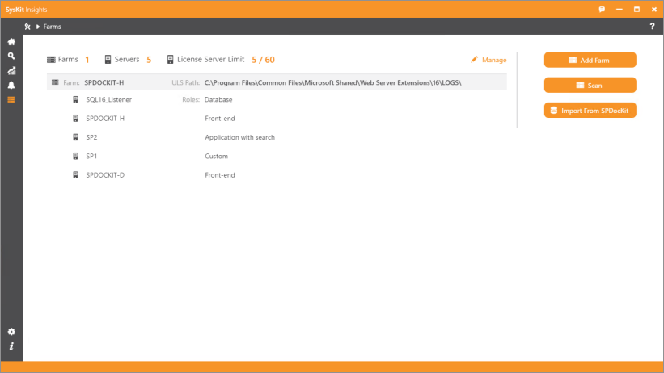
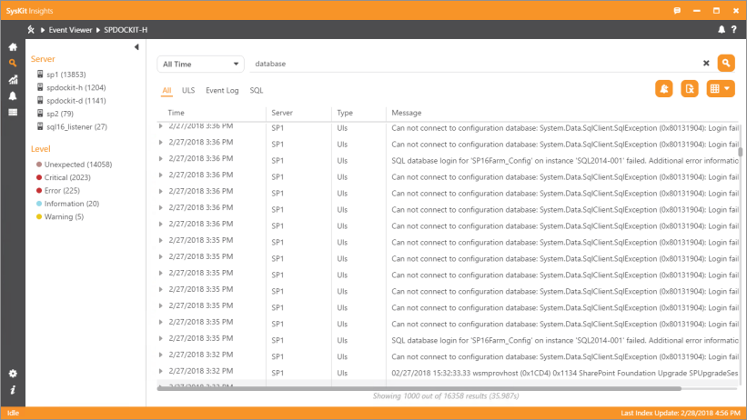
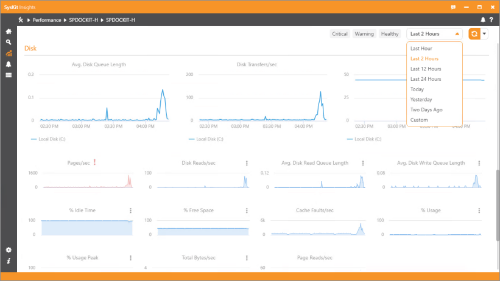
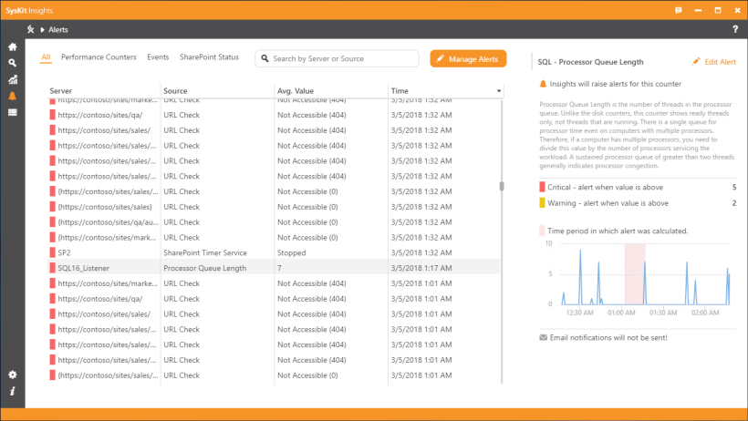

# Syskit Insights - SharePoint performance monitoring and troubleshooting

Performance monitoring is always hot topic when you are dealing with SharePoint. People may have different points of view of what exactly SharePoint performance monitoring is, but they will have one common thought: being proactive and knowing your environment's state at any time of day is always the way to go.

Syskit Insights is a **SharePoint-dedicated farm performance and troubleshooting tool**, created to make your life easier. Let's see what this version of the tool is bringing to the table.

[Try Syskit Insights Free](https://www.syskit.com/products/insights/download/)

**Product version:** 1.0.0  
**Build number:** 345  
**Release date:** Mar 7, 2018

## Farms Screen – Adding servers and farms with ease

The tool offers three possibilities – adding a single farm, scanning the entire environment to collect all accessible farms, or importing SharePoint servers directly from SPDocKit. Regardless of the method you choose, you won't need to install the tool on any other environment that you wish to monitor – Syskit Insights gathers all the information remotely.

* **Add Farm** – simply type in one SharePoint server from the farm you wish to monitor, and Syskit Insights will detect all other servers automatically.
* **Scan** – run Syskit Insights wizard to crawl the entire environment and present all accessible farms you might want to monitor. If you don't want to crawl the entire domain, choose a specific Organization Unit in which Syskit Insights will look for the farms. 
* **Import from SPDocKit** – if you already have SPDocKit installed in your environment, you can connect it with Syskit Insights and all the servers you are monitoring with SPDocKit will be added and monitored automatically.

Read more about [Farms screen](../get-to-know-insights/farms-screen.md) possibilities and management options.

## Home Dashboard – Global health overview of your environment

Home dashboard gives you the global state of your farms and servers.

The **Performance** part will alert you to the top 5 critical servers when it comes to disk usage, CPU utilization, and memory consumption. Also, you will get straightforward information how many servers are critical or in the warning phases. You can drill down to see more details about each component.

The other part of the Home screen will show you how many **Event Viewer** entries were detected per farm, sorted by source, server, and level. The “Entries by day” chart can help you detect trends on which days are the most critical when it comes to number of issues with regards to ULS, event log, or SQL entries.

Read more about [Home Dashboard.](../get-to-know-insights/insights-home.md)

## Event Viewer – The ultimate ally for searching through ULS, Windows event, and SQL logs

Syskit Insights collects all available **ULS, Windows event, and SQL logs from all added servers**. These entries are presented in one central console which allows you to **search by server, correlation ID, any other keyword, or even the level of events**. You can also change the period for which you want to search the logs through.

With Syskit Insights, you no longer have to manually search for important ULS or SQL entries from multiple servers when trying to troubleshoot your environment. This single point of interaction will present you with all the important information gathered from your servers.

If you wish to proactively track a certain issue or keyword, you can create an alert to receive notifications at a specified email address or just monitor them from the Syskit Insights Alerts tab.

Read more about [Event Viewer](../get-to-know-insights/event-viewer.md) functionality.

## Performance Dashboards – One screen to rule all performance counters

The Performance Dashboard gives you a centralized overview of your farms’ health. Servers that are healthy will be colored green, servers in the warning phase will be yellow, and the most problematic ones will be red.

One glance at this dashboard and you will see which servers you should be dealing with as soon as possible. The state of a servers is calculated **based on the thresholds for each of the 30-plus SharePoint-dedicated performance counters**. Drill down by each server or farm to explore in more detail every performance counter and track which component is the reason for SharePoint performance downgrading.

Syskit Insights can save performance data up to 30 days, so you can **use historical data to track each server's baseline during optimal performance**.

Create performance alerts to actively monitor all your servers and receive email notifications when something goes wrong. Acting in time will prevent your SharePoint from becoming slow or even going down.

Read more about [Performance](../get-to-know-insights/performance-screen.md) functionality.

## Alerts and Notifications – See what has been going on while you weren't looking

To keep up with potential bottlenecks and problems detected in your environment, we created the Alerts tab. Here you can **track down all performance alerts, Event Viewer entries you marked as potentially interesting and problematic, and the results of SharePoint status inspections**. SharePoint status alerts can help you detect if your Central Administration and most important site collection on the farm are inaccessible, or if the SharePoint Timer service has stopped working.

Use the **Manage Alerts** button to add new alerts, change thresholds for critical and warning states, or modify current alert settings.

Read more about [Alerts.](../get-to-know-insights/insights-alerts.md)

## Settings – Modify Syskit Insights configuration to completely match your needs

For complete control of Syskit Insights, check out the Settings section. Here you can **configure the email settings needed to send email notifications, modify which logs will be collected, and other data collection options**.

Read more about available configurable [Settings.](../how-to/customize-settings.md)

## Tell us what you think!

Your feedback and suggestions will help us build better SharePoint admin tools, so please feel free to [contact us](https://www.syskit.com/company/contact-us/) and send us your feedback and suggestions.

[Try Syskit Insights Free](https://www.syskit.com/products/insights/download/)

